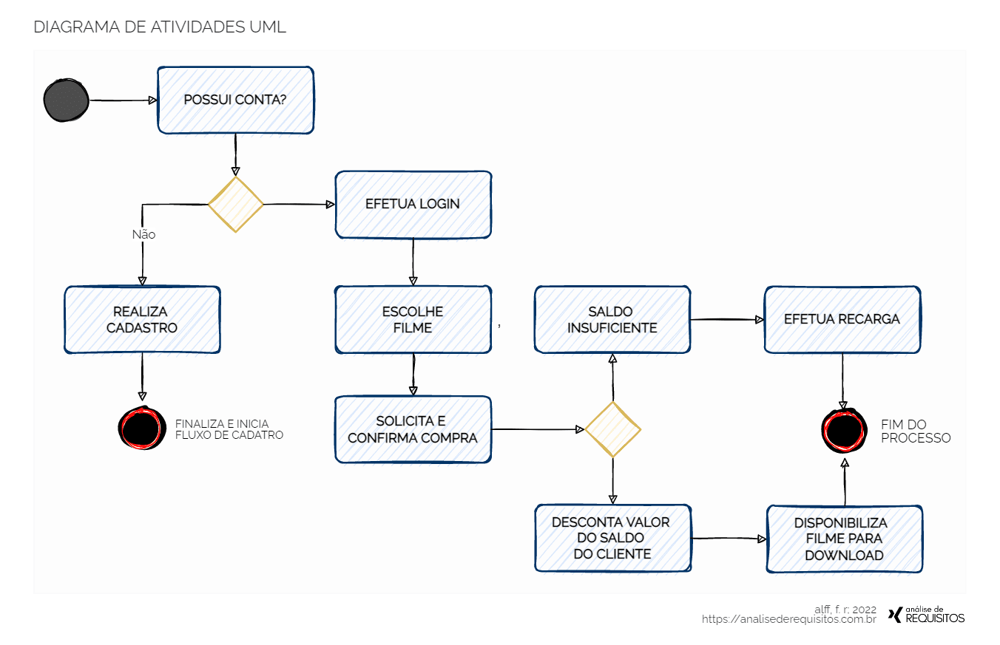

# 🛠️ Práctica XX: [Nombre de la Práctica]

## 📝 Objetivo de la Práctica
[Describe brevemente qué se logró en esta práctica. Ej. Aplicar el manejo de entradas y salidas digitales...].

## 📦 Materiales Utilizados
* 1x Raspberry Pi Pico 2 W
* 1x Cable Micro-USB
* [Agrega aquí otros componentes: LEDs, resistencias, botones, etc.]

## 🔌 Diagrama de Conexión y Simulación

**🔗 Enlace a la simulación en Wokwi:**
[Haz clic aquí para ver y correr la simulación](https://wokwi.com/projects/300504213470839309)

## 💻 Códigos Fuente y Explicación

### 🐍 MicroPython
📄 **Código fuente:** [Ver archivo `main.py` aquí](./main.py)

**Explicación de la lógica en Python:**
[Explica brevemente cómo configuraste los pines, qué hace el bucle principal y cómo resolviste el problema].

### ⚙️ C/C++ (Pico SDK)
📄 **Código fuente:** [Ver archivo `main.c` aquí](./main.c)

**Explicación de la lógica en C/C++:**
[Explica las funciones del SDK que usaste, como `gpio_init()`, y cómo se estructuró el código].

## 🎥 Evidencia en Video
[▶️ Ver demostración en video aquí](https://www.youtube.com/watch?v=dQw4w9WgXcQ)

## 🤔 Conclusiones o Retos Superados
[Reflexiona sobre qué te costó trabajo, errores de compilación o de lógica, y cómo los solucionaste].
